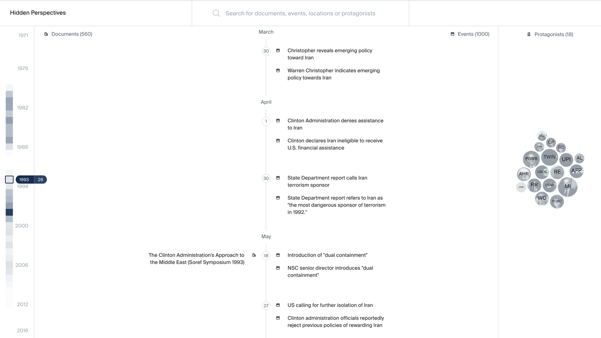
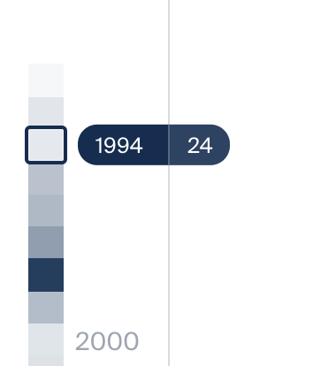
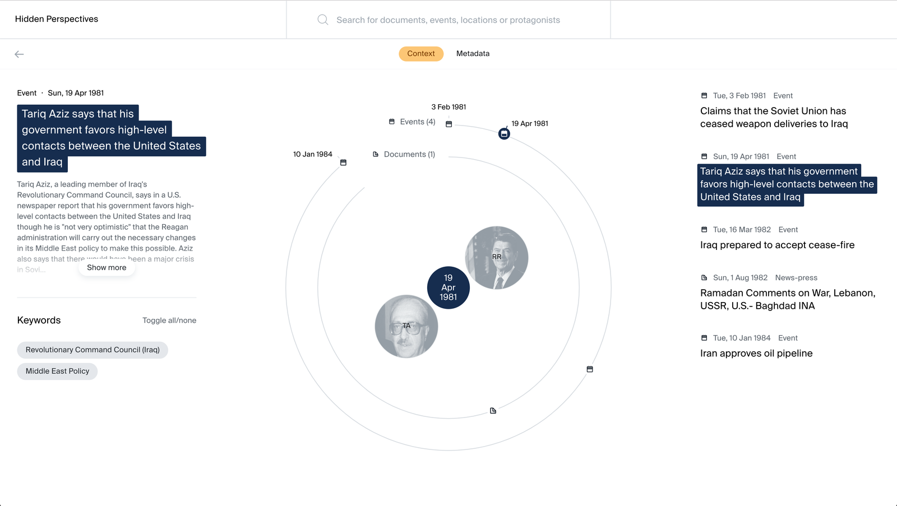
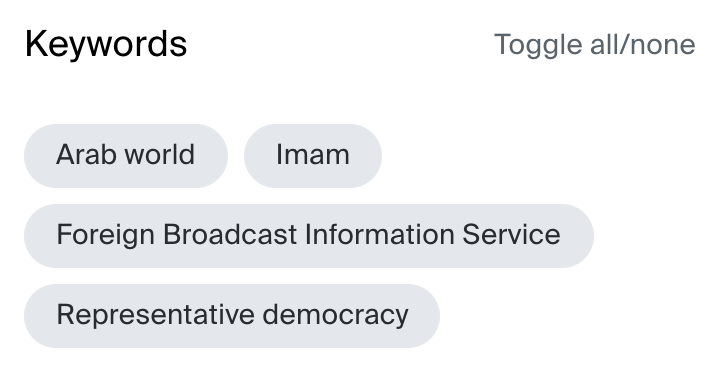

# Design Documentation
## About this project

One of the vexing issues besetting those active in international relations is the problem of knowledge — how much do we know about a particular situation, country, leader, movement, et cetera?  Do we know enough to make good decisions? How confident are we about the information at hand?  Who is providing that information? Do we have a grasp of what we don’t know?  The infamous “black swan” — an unexpected, damaging event — often results from the unknown.  Arrogance about knowledge, particularly the belief that one need not know much about unfolding events, is another major source of failure in global politics. The U.S.-Iran relationship has long been staggered by each party’s ignorance about the other. Missed opportunities rose not merely from bad luck but from knowing too little vital information about the other.

This project has attempted to address this knowledge gap through methods typically used by scholars and policy analysts, such as reading deeply into the history of each country’s foreign policy and relationship with each other.  We have interviewed key players and absorbed the contemporary scholarship and reporting of others.  We have also done something unusual: conducted several “critical oral history” sessions where we brought together policy makers from several countries, mainly Iran and the United States but also others involved particularly in negotiations from Britain, France, and Italy. For those people — sometimes meeting each other for the first time—we provided briefing books of documents procured through Freedom of Information Act requests, plus open source documents (published interviews, analyses, memoirs, etc.).  Those documents are the bulk of what is now archived on this platform.  We also invited scholars of whatever period or events we were examining to join the conferences.  We convened five sessions: two on the period of reform (1996-2000), one on the Iran-Iraq War, one on the George W. Bush period, and one with British policy makers mainly focused on the nuclear negotiations.

Critical oral history adds to conventional methods by encouraging decision makers to ponder how and why they responded to events and to their counterparts. This enables some reflection that typically is not forthcoming in one-on-one interviews. The conferences, briefing documents, and scholars altogether encourage an unusual depth in considering events. This plattform therefore attempts to create a framework for scholars as well as for the public to explore this experience. For that we have automatically extracted named entities from the Events and Documents to generate links between them and uncover patterns in the data set. This automated process is subject to possible errors and biases and might have resulted in wrong links visible on this platform.

##Glossary

| ---| --- |
| Document   | Is part of an archive collected by John Tirman, Malcolm Byrne and Hussein Banai at the MIT Center for International Studies. The archive’s documents have been procured through Freedom of Information Act requests, and open source documents (published interviews, analyses, memoirs, etc.). There are scans of the original document as well as their transcripts. Furthermore, metadata have been added to each of the documents (title, summary, creation date, publication date, publisher, author, recipient, type, kind, …). Through automated named entity extraction we have added categories to the metadata, such as involved protagonists, events and locations. |
| Event       | Is part of a list of relevant events between 1975 and 2011 curated by John Tirman et al. as part of their preparation of several “critical oral history” conferences. The events metadata categories consist of title, summary, start and end date. Through automated named entity extraction we have added categories to the metadata, such as involved protagonists, events and locations. |
| Protagonist | Is a person, institution, organisation, author, publisher defined by either the documents’ metadata or the named entity extraction of documents and events. |
| Entity      | Is any of the above. |
| Tags        | Consist of the some of the metadata of documents and events, such as type and kind. Furthermore, they consist of events, locations, protagonists which have been automatically extracted from documents and events. |

# Component Descriptions

## Main Timeline

The Main Timeline is the starting point of the digital archive. Besides the header it consists four sections which are interrelated. The header on top is including the logo, a search bar and the navigation. The page’s body displays a centered timeline, which has both the archive’s documents and events. The documents are located on the timeline’s left side and the events on its right side. A mini-map on the very left side of the screen enables an overview about the distribution of data over the whole timeline. The very right side of the screen displays all protagonists which are either linked to a document or to an event currently visible in the viewport.

**Spacing Rules**

The timeline is centered, the Protagonist view and the minimap, are locked on the left and right side of the timeline.

**Timeline**

The Main Timeline is one of the web app’s central features. It contains all the provided data of documents and events in chronological order. On the right hand are the events, on the left the documents. Events and Documents are marked with a small icon.

**Order of Events and Documents**

The timeline works like a list displaying older events and documents on top and more recent events at the bottom. While Events are sorted by starting date, Documents are sorted by their creation date. Years and months are dynamically displayed in a sticky bar on top, while the days are part of the scrolling timeline. The spacing between the days is always the same regardless of the actual time in between (the spacing between the 1st and the 2nd of a month will be the same as between the 1st and 20st if there is no data in between)

### Tooltip

By hovering a document or event, the title is highlighted and the Tooltip is shown.
It contains a small preview of the metadata.

**Documents**

The document tooltip contains a small thumbnail of the original file and the summary.

**Event**

In the event tooltip there is only the summary shown.

### Highlighting & pinning

**Main timeline**

By hovering over an element, the element gets highlighted.
If the hovered element is a protagonist, all the linked documents and events are highlighted as well.

**Detail view**

In the detail view by hovering you always see the linked nodes, and keywords highlighted.

**Pinning**

You can pin highlighted nodes, by clicking on the name. This way you can take a closer look to the connected keywords or nodes.

### Minimap

The minimap is shown on the left of the timeline. It’s meant for a quick preview for the user.
The small rectangles on the left show at how many events and documents are available at what time in the archive.
The marker indicates what time frame is currently visible on the viewport.

**Rectangle rules**

- Each rectangle symbolizes one year
- The year with the most events and documents define the maximum opacity the year with the less defines the minimum opacity.
- The tooltip shows which year is selected and, the number on the right is the actual number of events and documents, that the year contains.

### Protagonist Cluster

Protagonists, that are related to the events or documents in the viewport are shown as circle cluster on the right of the Main Timeline screen. They stick to the timeline. The size depends on how often there are mentioned in the Viewport.

**Pictures**

If provided, a picture is used instead of the grey circle

**Size Rules**

The size is co-dependent on how many protagonists are visible and the space available. The protagonist with the most connection defines the maximal expansion and the one with the least is defining the minimum.
Should there be 2 or more with the same amount of connections, they can share their size.
These rules are for both, Main Timeline and the Detail View.

### Position Rules
**Main Timeline**

The Cluster sticks to the right side of the Timeline. It’s drawn towards the Timeline. The Position of the Circles inside the cluster is random.

**Detail View**

The person cluster is drawn to the middle of the circular timeline. The Position of the Circles inside the cluster is random. They leave a space in the middle, for the selected node bubble to be shown.

**Nametagging**

The Name of the Entity is written shortend inside of the circle.
Should the entity’s name consist of more than one word, we use the first letter of the first and of the last name, both as capital letter, like initials. This works with up to 4 Words. Should it only contain one word (e.g. Tehran) we use the first two letter, also both as capital.
Example:

New York - **NY**

United State Departement of State - **USDS**

Tehran - **TE**

### Searchbar

The Searchbar works like a fulltext search.
If you type in a keyword, the results are ordered by which node fits the best.
All nodes are shown in a mixed way, but it is possible to sort them by type with pressing Tab.
After clicking on a result you reach the detail view of the node.

### Detail View

The Detail View can be reached by searching for a specific node or by clicking on a node (e.g. in the Main Timeline). It gives the user the ability to look deeper into the node, by seeing its related nodes, its metadata and, in case of documents, its transcript and original PDF file.

**Tab system**

To get to the different parts of the Detail View, we use a tab navigation, which is visible at any time in every Detail View.

There are 2 tabs in the Detail Views of events and protagonists and 4 tabs in the Detail View of documents. The tabs “Context” and “Metadata” appear in every Detail Views. Document have two additional tabs: “Transcript” and “Original”. Currently selected tabs are highlighted.

### Context

**Circular timeline**

The primary view of the Detail View contains a circular timeline, which lists all nodes related to the currently selected node. All Protagonists are visible in the middle around the central node, while the documents and events are listed in two circles of wider radius. Like in the Main Timeline, the events are symbolized by little icons (as explained in the main timeline).

The selected node is highlighted in blue in the circular timeline.

Depending on which type of node is represented as the central node in the Detail View (Event, document or protagonist), the related nodes shown on the circular timeline may vary:

|   | Related documents | Related events | Related protagonists |
| ---| --- | --- | --- |
| When the central node is a document    | Related documents are those that share at least one tag.  This is independent of the tag’s type. | Related events are those that share at least one tag.  This is independent of the tag’s type. | Related protagonists are those that are mentioned in the document                           |
| When the central node is an event      | Related documents are those that share at least one tag.  This is independent of the tag’s type. | Related events are those that share at least one tag.  This is independent of the tag’s type. | Related protagonists are those that are mentioned in the event                              |
| When the central node is a protagonist | Related documents are those in which the protagonist is mentioned in.                                  | Related events are those in which the protagonist is mentioned in.                                  | Related protagonists are those that are also mentioned in the related documents and events. |

**Summary section**

On the right side of the Detail View is a scrollable list of the related nodes also visible in the circular timeline. This gives the users a textual overview including: the node’s title, its date, a short summary,  and the kind (event, speech, statement…).

**Keywords**

Keywords are collected for documents and events through entity extraction. They are used as filter and are shown in the down left corner of the Details View’s context tab.

By clicking on one tag, all other tags will be deselected. Only the clicked tag will be highlighted. Now the users will see only the nodes narrowed down to those tagged with the highlighted tag.
Users can combine more tags by clicking on them one by one.
If they want to see the whole connected nodes again, they can use the “toggle all/none” button.

**Metadata**

In the metadata tab the user can see all the metadata provided, depending on the node type.

**Document**

A document contains the most meta data, it is clustered in 4 categories:

- Core information:
  - title
  - summary
  - creation date
  - publication date
- Appearences
  - Protagonists
- Categorization
  - Kind
  - Classification
  - Tags

Event
Three categories

- Core Information
  - title
  - description
  - start-date
  - end-date
- Appearences
  - Protagonists
- Categorization
  - tags

Protagonists

- Core information
  - title
  - description
  - wikipedia link
- Authored
  - documents
- Appearences
  - documents
  - events

**Transcript**

A tap only available for documents. Here can the transcript of a document be seen and edited if necessary.

**Original**

A tap only available for documents. Here can the original document be seen as a pdf.
